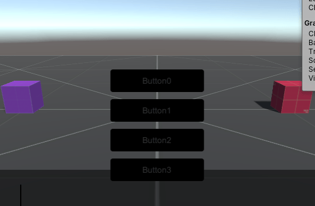
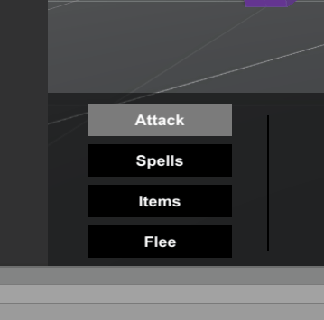
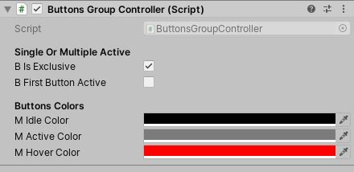

# Buttons Group for Unity

This repository contains a prefab and related scripts to create a Buttons group for Unity.

## Support 

This asset was created and tested on 2019.3.0f3 Personal with the Standard Rendering Pipeline.

I don't think there will be any issues with other versions, but if you encounter a problem please create an issue/pr so I can check it out.

## What is a Buttons Group?

It is a group of buttons (duh) with a parent ButtonsGroupController. On clicking a button, the button notifies its parent of the event. The ButtonsGroupController records the new state for the button, and changes the state of other buttons.

The main use for this prefab is to create "Radio Buttons", meaning only one button can be active at a time. The gifs shows it working (low quality gifs, will be updated).

It also enables the developper to have access to different buttons state from a single class instead of checking it from multiple buttons, but the main intent was reusability for UI creation.

  
Buttons group in action, with exclusive selection turned on.

  
It also supports non exclusive selection.

  
It can also work as a radio button with bEnforceOneActive as false and bIsExclusive as true

## Features

Support for clicks and hover detection, exclusive and non-exclusive selection.

The ButtonsGroup also autodetects its children buttons and gives them an index on start for reference in notifications. This means you can easily add/delete buttons.

Finally, it is possible to set the first button in the list as on by default.

## How to Use

Paste the Prefab and the scripts in your Asset folder, instantiate a ButtonsGroup, set the desired colors and image/material for idle/hover/active states and voila! You're done!

   
Inspector View of Buttons Group

Set bIsExclusive as true to enable exclusive selection.  
Set bFirstButtonActive to set the first button as active on start.

The buttons objects are not Unity UI buttons, but simple Monobehaviour classes implementing interfaces to detect clicks and hovers (IPointerClickHandler, IPointerEnterHandler, IPointerExitHandler).

To interface with another class, such as a GameManager, you can access the current active states of button by using the method GetListActiveButtons of the ButtonsGroupControl class.

## Additional Usage Notes

This implementation both allows or disallows having no active buttons, depending on the parameters you set.

The Initialization logic is contained in the method "RegisterElements" of ButtonsGroupController.cs. This is to allow registering buttons added at runtime if needed.

## Documentation

The code is very straightforward so I do not include any documentation.  
Call the method GetListActiveButtons to get a boolean list of status for buttons (basically returns "is the button selected or not?").  

To interface with your state manager or another class, I would suggest adding a reference to the target component, and calling it in SetColorButtons() to ensure you are sending the most updated state and not an intermediate dirty state. I left comments from my own code calling _mBattleController as a guide to how you could proceed to implement this.

